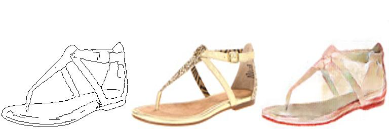

# edges2shoes
本项目是一个基于pix2pix模型的项目，生成器是一个unet，判别器一个5层卷积核为4的卷积神经网络。数据edge2shoes数据集，train包含49,825张图像，val包含200
张图像，链接是：https://pan.baidu.com/s/1ofgUIkFyW5ORiymPl5e6Ew  ，要使程序运行需要加载模型文件，https://pan.baidu.com/s/1ZpilB9geY8H3mwp-VfUsbg
，并执行test.ipynb，训练则执行pix2pix_diy.ipynb，项目目录请参照项目目录.JPG. 
下面是程序运行的一些结果： 

